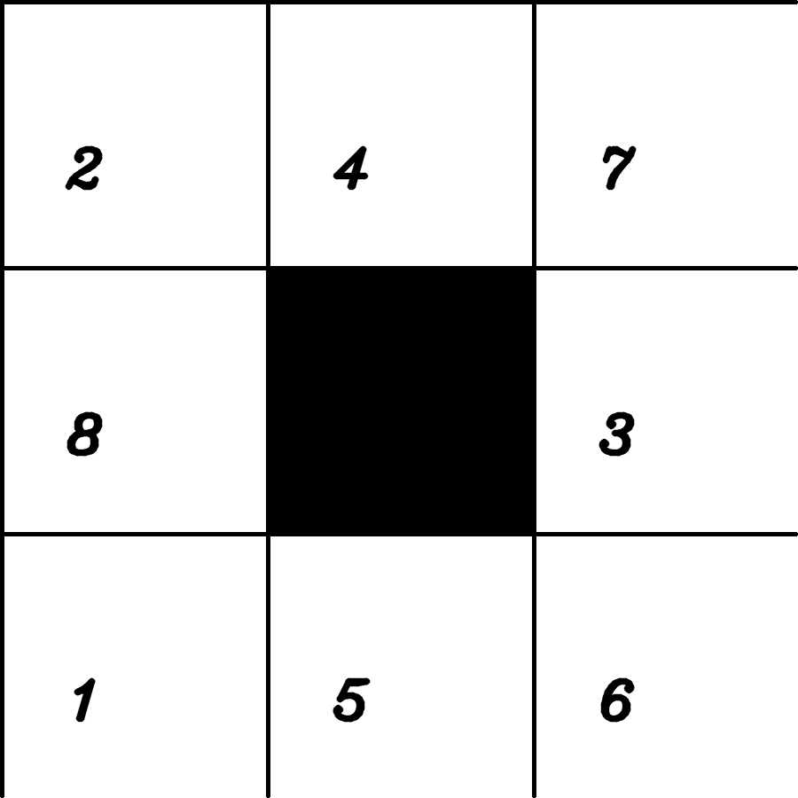
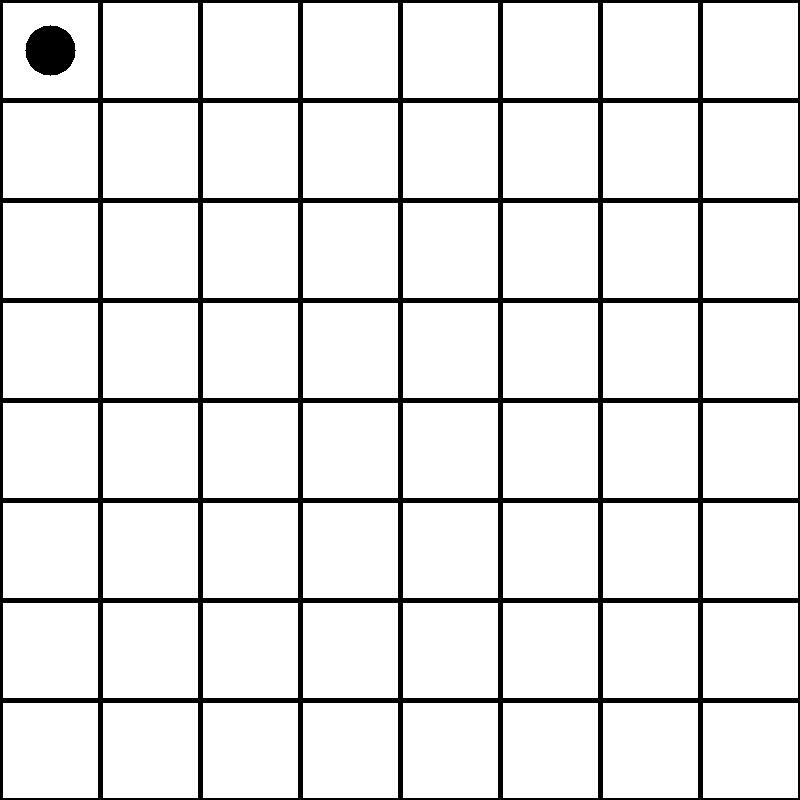
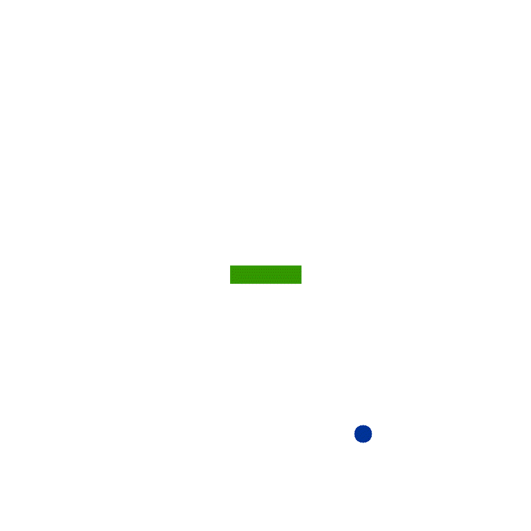

# AI Toy Games

Collection of very simple toy problems in the form of games, solved using traditional AI techniques (A*, backtrack, local search).

All games and algorithms are entirely implemented in Python (with numpy dependency) therefore speed isn't really the focus here as I did this merely for fun (aka educational purposes). Nonetheless, there are a few cool tricks for optimizing stuff (e.g. numpy `stride_trick` for checking sudoku blocks).

Most if not all games here can be formalized as CSP problems, so most solutions presented here explicitely refer to CSP as presented in the book `Artificial Intelligence: A Modern Approach`, off of which most implementations are inspired from.

# Run games
All games are playable and you can run them by executing the corresponding file/script as in `python3 toy_games/games/snake.py`.

You can then test out how different configuration play out (e.g. size of grid world).
# Examples
### Sliding Block Puzzle, A* search
___

### N Queens, backtrack search
___

### Sudoku, generating solvable sudokus through backtrack search
___

### Snake (with Gym snake environment), DQN
___

